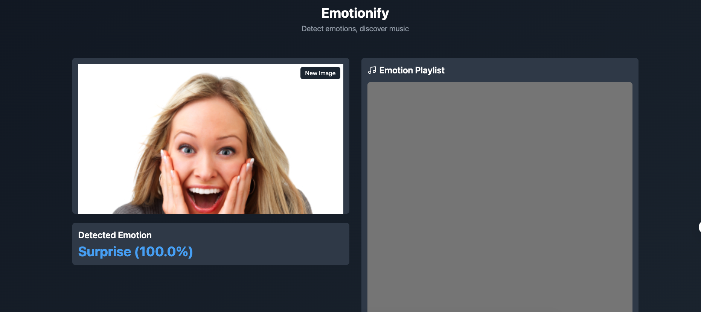

# Emotionfy

## Emotion-Driven Playlist Recommendation System 🎵

INTRODUCTION

 <strong>Emotionfy</strong> is a cutting-edge system that merges the power of emotion detection with personalized music recommendations. Using deep learning for facial emotion recognition and Spotify’s API, this application recommends playlists tailored to the user’s emotional state. Upload an image, and <strong>Emotionfy</strong> will do the rest — analyzing your emotion and curating a playlist to match your mood. 

TEAM MEMBERS

<strong>Rey Reyes</strong>: CNN Researcher, Backend Developer   <strong>Lucas Yao</strong>: Backend Developer, Frontend Support   <strong>Fei Lin</strong>: Frontend Developer, Backend Support 

DATASETS USED

 1. <a href="https://www.kaggle.com/datasets/ananthu017/emotion-detection-fer">Emotion Detection FER Dataset</a>   This dataset contains 35,887 grayscale 48x48 pixel images labeled with the following emotions: - Angry - Disgust - Fear - Happy - Neutral - Sad - Surprise 
 
 2. <a href="https://www.kaggle.com/datasets/jonathanoheix/face-expression-recognition-dataset">Face Expression Recognition Dataset</a>   A complementary dataset designed for facial emotion recognition tasks. 

GOAL

 To enhance emotion detection by integrating Spotify's API, <strong>Emotionfy</strong> recommends playlists based on user emotions. The deep learning model analyzes facial expressions and maps them to Spotify playlists, offering a seamless blend of technology and music personalization. 

MODEL ARCHITECTURE

 <strong>Base Model:</strong> Trained a CNN on the FER Kaggle dataset for emotion classification.   <strong>Emotion-to-Playlist Mapping:</strong> A custom layer maps detected emotions to Spotify playlists for seamless recommendations. 

TECH STACK

Frontend

 <a href="https://react.dev/">React</a>: Interactive user interface 

Backend

  <a href="https://flask.palletsprojects.com/">Flask</a>: API communication and emotion detection    <a href="https://developer.spotify.com/documentation/web-api/">Spotify Web API</a>: Playlist recommendations 

Data Processing

  Data augmentation and preprocessing techniques for improved model generalization 

Libraries and Tools

  <a href="https://www.tensorflow.org/">TensorFlow</a> and <a href="https://keras.io/">Keras</a>: Deep learning frameworks    <a href="https://opencv.org/">OpenCV</a>: Image processing    <a href="https://pandas.pydata.org/">Pandas</a> and <a href="https://numpy.org/">Numpy</a>: Data handling    <a href="https://matplotlib.org/">Matplotlib</a> and <a href="https://seaborn.pydata.org/">Seaborn</a>: Data visualization    <a href="https://jupyter.org/">Jupyter Notebook</a>: Model development and experiments 

Integration

  <a href="https://developer.spotify.com/documentation/general/guides/authorization-guide/">Spotify OAuth 2.0</a>: Secure user authentication for playlist access   Spotify Web Playback SDK: Music playback within the interface 

FEATURES

 1. <strong>Emotion Detection</strong>    Analyze facial expressions in images or real-time video streams.   Detect and classify emotions such as Happy, Sad, Angry, etc. 
 
 2. <strong>Playlist Recommendation</strong>    Fetch Spotify playlists tailored to the detected emotion.   Play music directly within the app. 
 
 3. <strong>User Interface</strong>   Upload images or stream video for real-time emotion analysis.    Display detected emotions with an accompanying playlist. 

EVALUATION METRICS

  <strong>Emotion Detection:</strong> Accuracy, precision, recall, F1-score    <strong>Playlist Recommendation:</strong> Relevance and alignment based on user feedback 

SETUP INSTRUCTIONS

Requirements

  Python 3.8 or above    Spotify Developer Account (for API integration) 

Steps

 1. Clone the repository: <pre> git clone https://github.com/your-username/emotionfy.git cd server </pre> 
 
 2. Install dependencies: <pre> pip install -r requirements.txt </pre> 
 
 3. Configure Spotify API:    Create a <a href="https://developer.spotify.com/">Spotify Developer Account</a>.    Set up an app and note the <strong>Client ID</strong> and <strong>Client Secret</strong>.    Update the <code>config.py</code> file with these credentials. 
 
 4. Run the application: <pre> npm dev run </pre> 
 
 5. Run the server: <pre> python3 main.py </pre> 
 
USER INTERFACE

  

FUTURE ENHANCEMENTS

  <strong>User Customization:</strong> Link personal Spotify accounts for tailored recommendations.    <strong>Platform Expansion:</strong> Integration with Apple Music and other music platforms.    <strong>Improved Emotion Detection:</strong> Incorporate video-based emotion tracking for dynamic recommendations. 

CODE LICENSE

 <pre> MIT License
Copyright (c) 2024 Emotionfy Team

Permission is hereby granted, free of charge, to any person obtaining a copy of this software and associated documentation files (the "Software"), to deal in the Software without restriction, including without limitation the rights to use, copy, modify, merge, publish, distribute, sublicense, and/or sell copies of the Software, and to permit persons to whom the Software is furnished to do so, subject to the following conditions:

The above copyright notice and this permission notice shall be included in all copies or substantial portions of the Software.

THE SOFTWARE IS PROVIDED "AS IS", WITHOUT WARRANTY OF ANY KIND, EXPRESS OR IMPLIED, INCLUDING BUT NOT LIMITED TO THE WARRANTIES OF MERCHANTABILITY, FITNESS FOR A PARTICULAR PURPOSE AND NONINFRINGEMENT. IN NO EVENT SHALL THE AUTHORS OR COPYRIGHT HOLDERS BE LIABLE FOR ANY CLAIM, DAMAGES OR OTHER LIABILITY, WHETHER IN AN ACTION OF CONTRACT, TORT OR OTHERWISE, ARISING FROM, OUT OF OR IN CONNECTION WITH THE SOFTWARE OR THE USE OR OTHER DEALINGS IN THE SOFTWARE. </pre>

